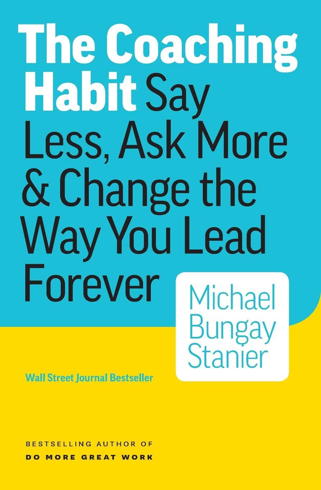

I have recently watched a video at the beginning of the week about **THE COACHING HABIT** by Michael Bungay Stanier. Stainer advocates that the best mentors and trainer are those that "listen more" and "talk less". That one's advise is not as good as we think it is.

>"The change of behavior at the heart of what this book is about is this: a little more asking people questions
>and a little less telling people what to do."

He advises to engage people through a few key questions:
  - What's on your mind?
  - What else? Any other challenges?
  - What is the real challenge for you?
  - What give you the most relief?
  - If you say yes to one thing what would you say no to?

Stainer devised a template to collect data on mentoring sessions based on these set of questions. This is meant to engage people on the issues that matter most and to reflect on what they need to do as well as what they do not need to do so that they are focused on what really matters and brings them most satisfaction. 

Learning what not to do is a key concept in being efficient and productive, as business coach **Mickael Porter** said: 

>"The essense of strategy is knowing what not to do"

